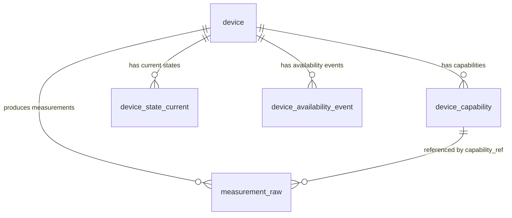

# Описание таблиц схемы БД

Источник: `001_schema.sql`

## Общее назначение схемы

Схема описывает хранение данных об устройствах, их возможностях, текущих состояниях, сырых измерениях, событиях доступности и событиях ingestion-пайплайна. По структуре видно, что БД рассчитана на IoT/Smart Home сценарий, где устройства имеют набор capabilities, публикуют телеметрию, а система фиксирует как последние состояния, так и исторические события.

## Диаграмма связей



## Таблицы

### `device`

Справочник физических или логических устройств.

| Колонка | Тип | NULL | Default | Ограничения | Описание |
|---|---:|:---:|---|---|---|
| `id` | `UUID` | Нет | — | `PRIMARY KEY` | Внутренний идентификатор устройства. |
| `external_device_id` | `TEXT` | Нет | — | `UNIQUE` | Внешний идентификатор устройства в источнике/интеграции. |
| `name` | `TEXT` | Нет | — | — | Человекочитаемое имя устройства. |
| `manufacturer` | `TEXT` | Нет | — | — | Производитель устройства. |
| `model` | `TEXT` | Да | — | — | Модель устройства. |
| `firmware_version` | `TEXT` | Да | — | — | Версия прошивки. |
| `protocol` | `TEXT` | Нет | — | — | Протокол взаимодействия. |
| `transport` | `TEXT` | Да | — | — | Транспортный уровень или канал связи. |
| `room` | `TEXT` | Да | — | — | Помещение/зона размещения устройства. |
| `read_only` | `BOOLEAN` | Нет | `TRUE` | — | Признак устройства только для чтения. |
| `controllable` | `BOOLEAN` | Нет | `FALSE` | — | Признак возможности управления устройством. |
| `metadata` | `JSONB` | Нет | `'{}'::jsonb` | — | Дополнительные атрибуты устройства в JSON. |
| `created_at` | `TIMESTAMPTZ` | Нет | `now()` | — | Время создания записи. |
| `updated_at` | `TIMESTAMPTZ` | Нет | `now()` | — | Время последнего обновления записи. |
| `last_seen_at` | `TIMESTAMPTZ` | Да | — | — | Время последней активности устройства. |

**Индексы:**

| Индекс | Колонки | Назначение |
|---|---|---|
| `idx_device_external_device_id` | `external_device_id` | Быстрый поиск устройства по внешнему идентификатору. |

---

### `device_capability`

Справочник возможностей устройства: измерения, состояния, команды или иные функции, доступные для конкретного устройства.

| Колонка | Тип | NULL | Default | Ограничения | Описание |
|---|---:|:---:|---|---|---|
| `id` | `UUID` | Нет | — | `PRIMARY KEY` | Внутренний идентификатор capability. |
| `device_id` | `UUID` | Нет | — | `REFERENCES device(id) ON DELETE CASCADE` | Устройство, которому принадлежит capability. |
| `capability_id` | `TEXT` | Нет | — | `UNIQUE (device_id, capability_id)` | Идентификатор capability внутри модели backend. |
| `capability_type` | `TEXT` | Нет | — | — | Тип capability, название метрики на устройстве |
| `direction` | `TEXT` | Нет | — | — | Направление capability: чтение, запись или двунаправленное использование. |
| `unit` | `TEXT` | Да | — | — | Единица измерения. |
| `value_type` | `TEXT` | Нет | — | — | Тип значения: числовой, текстовый, булевый, JSON и т.п. |
| `metadata` | `JSONB` | Нет | `'{}'::jsonb` | — | Дополнительные параметры capability. |
| `created_at` | `TIMESTAMPTZ` | Нет | `now()` | — | Время создания записи. |
| `updated_at` | `TIMESTAMPTZ` | Нет | `now()` | — | Время последнего обновления записи. |

**Индексы и ограничения:**

| Объект | Колонки | Назначение |
|---|---|---|
| `UNIQUE (device_id, capability_id)` | `device_id`, `capability_id` | Запрещает дубли capability в рамках одного устройства. |
| `idx_capability_device_capability_id` | `device_id`, `capability_id` | Быстрый поиск capability устройства. |

---

### `measurement_raw`

Историческая таблица сырых измерений/событий телеметрии. Хранит входящие значения от устройств без агрегации до одного текущего состояния.

| Колонка | Тип | NULL | Default | Ограничения | Описание |
|---|---:|:---:|---|---|---|
| `event_ts` | `TIMESTAMPTZ` | Нет | — | — | Время события на стороне источника или устройства. |
| `server_received_at` | `TIMESTAMPTZ` | Нет | `now()` | — | Время получения события сервером. |
| `device_id` | `UUID` | Нет | — | `REFERENCES device(id) ON DELETE CASCADE` | Устройство-источник измерения. |
| `capability_ref` | `UUID` | Да | — | `REFERENCES device_capability(id) ON DELETE SET NULL` | Ссылка на capability, если она была сопоставлена. |
| `metric` | `TEXT` | Нет | — | — | Имя метрики. |
| `capability_id` | `TEXT` | Нет | — | — | Идентификатор capability из сообщения/источника. |
| `value_num` | `DOUBLE PRECISION` | Да | — | — | Числовое значение. |
| `value_text` | `TEXT` | Да | — | — | Текстовое значение. |
| `value_bool` | `BOOLEAN` | Да | — | — | Булево значение. |
| `unit` | `TEXT` | Да | — | — | Единица измерения значения. |
| `source` | `TEXT` | Нет | — | — | Источник события/интеграция. |
| `seq` | `BIGINT` | Да | — | — | Последовательный номер события, если источник его предоставляет. |
| `quality` | `SMALLINT` | Нет | `100` | — | Оценка качества значения. |
| `raw_payload` | `JSONB` | Да | — | — | Исходное сообщение целиком или его значимая часть. |

**Индексы:**

| Индекс | Колонки | Назначение |
|---|---|---|
| `idx_measurement_device_metric_ts` | `device_id`, `metric`, `event_ts DESC` | Поиск истории конкретной метрики устройства с сортировкой от новых событий к старым. |
| `idx_measurement_capability_type_ts` | `capability_type`, `event_ts DESC` | Должен был бы ускорять выборку по типу capability и времени. См. замечание ниже. |

```sql
CREATE INDEX idx_measurement_capability_type_ts
ON measurement_raw (capability_type, event_ts DESC);
```

---

### `device_state_current`

Таблица текущих состояний capabilities устройств. В отличие от `measurement_raw`, хранит только последнее актуальное значение для пары `device_id + capability_id`.

| Колонка | Тип | NULL | Default | Ограничения | Описание |
|---|---:|:---:|---|---|---|
| `device_id` | `UUID` | Нет | — | `REFERENCES device(id) ON DELETE CASCADE`, `PRIMARY KEY(device_id, capability_id)` | Устройство, состояние которого хранится. |
| `capability_id` | `TEXT` | Нет | — | `PRIMARY KEY(device_id, capability_id)` | Capability, состояние которой хранится. |
| `event_ts` | `TIMESTAMPTZ` | Нет | — | — | Время события, из которого получено текущее состояние. |
| `server_received_at` | `TIMESTAMPTZ` | Нет | — | — | Время получения события сервером. |
| `value_num` | `DOUBLE PRECISION` | Да | — | — | Числовое значение текущего состояния. |
| `value_text` | `TEXT` | Да | — | — | Текстовое значение текущего состояния. |
| `value_bool` | `BOOLEAN` | Да | — | — | Булево значение текущего состояния. |
| `value_json` | `JSONB` | Да | — | — | JSON-значение текущего состояния. |
| `unit` | `TEXT` | Да | — | — | Единица измерения. |
| `source` | `TEXT` | Нет | — | — | Источник текущего состояния. |

**Ограничения:**

| Ограничение | Колонки | Назначение |
|---|---|---|
| `PRIMARY KEY(device_id, capability_id)` | `device_id`, `capability_id` | Гарантирует одну актуальную запись на capability устройства. |

---

### `device_availability_event`

История событий доступности устройств: online/offline/unknown и причины изменения статуса.

| Колонка | Тип | NULL | Default | Ограничения | Описание |
|---|---:|:---:|---|---|---|
| `id` | `UUID` | Нет | — | `PRIMARY KEY` | Идентификатор события доступности. |
| `device_id` | `UUID` | Нет | — | `REFERENCES device(id) ON DELETE CASCADE` | Устройство, к которому относится событие. |
| `event_ts` | `TIMESTAMPTZ` | Нет | — | — | Время события доступности. |
| `server_received_at` | `TIMESTAMPTZ` | Нет | `now()` | — | Время получения события сервером. |
| `status` | `TEXT` | Нет | — | — | Статус доступности. |
| `reason` | `TEXT` | Да | — | — | Причина изменения статуса. |
| `source` | `TEXT` | Нет | — | — | Источник события. |
| `raw_payload` | `JSONB` | Да | — | — | Исходное сообщение события. |

**Индексы:**

| Индекс | Колонки | Назначение |
|---|---|---|
| `idx_availability_device_ts` | `device_id`, `event_ts DESC` | Быстрый просмотр истории доступности конкретного устройства от новых событий к старым. |

---

### `ingestion_event`

Журнал обработки входящих сообщений ingestion-пайплайном. Нужен для аудита, диагностики ошибок и трассировки MQTT-сообщений.

| Колонка | Тип | NULL | Default | Ограничения | Описание |
|---|---:|:---:|---|---|---|
| `id` | `UUID` | Нет | — | `PRIMARY KEY` | Идентификатор события ingestion. |
| `server_received_at` | `TIMESTAMPTZ` | Нет | `now()` | — | Время получения сообщения сервером. |
| `mqtt_topic` | `TEXT` | Нет | — | — | MQTT topic входящего сообщения. |
| `message_type` | `TEXT` | Да | — | — | Тип сообщения, если он определён. |
| `device_external_id` | `TEXT` | Да | — | — | Внешний идентификатор устройства из сообщения. |
| `status` | `TEXT` | Нет | — | — | Результат обработки сообщения. |
| `error_code` | `TEXT` | Да | — | — | Код ошибки обработки. |
| `error_message` | `TEXT` | Да | — | — | Текст ошибки обработки. |
| `raw_payload` | `JSONB` | Да | — | — | Исходное сообщение. |

**Индексы:**

| Индекс | Колонки | Назначение |
|---|---|---|
| `idx_ingestion_event_received_at` | `server_received_at DESC` | Быстрый просмотр последних ingestion-событий. |

## Внешние ключи

| Таблица | Колонка | Ссылка | Поведение при удалении | Смысл |
|---|---|---|---|---|
| `device_capability` | `device_id` | `device(id)` | `ON DELETE CASCADE` | При удалении устройства удаляются его capabilities. |
| `measurement_raw` | `device_id` | `device(id)` | `ON DELETE CASCADE` | При удалении устройства удаляется его история измерений. |
| `measurement_raw` | `capability_ref` | `device_capability(id)` | `ON DELETE SET NULL` | При удалении capability историческое измерение сохраняется, но ссылка очищается. |
| `device_state_current` | `device_id` | `device(id)` | `ON DELETE CASCADE` | При удалении устройства удаляются его текущие состояния. |
| `device_availability_event` | `device_id` | `device(id)` | `ON DELETE CASCADE` | При удалении устройства удаляется история его доступности. |